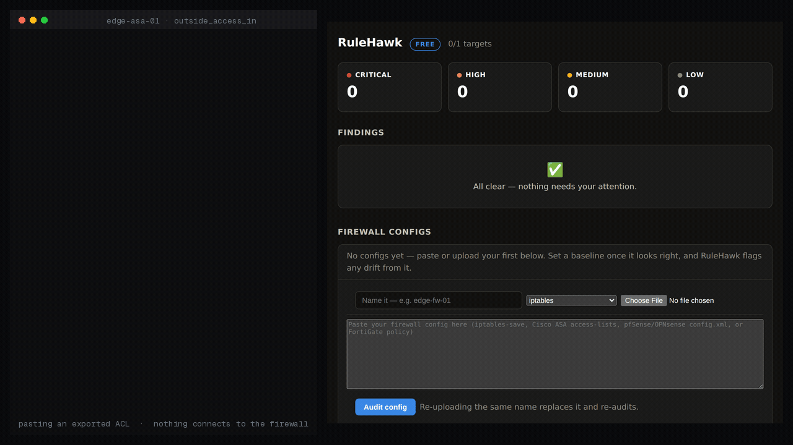

# RuleHawk

**Self-hosted firewall config auditor — find shadowed rules, permissive allows, and config drift across every vendor.**



*Real run: a Cisco ASA ACL where `deny ip host 172.16.9.31 any` sits below
`permit ip 172.16.8.0/21 any`. The host someone blocked after an incident is still getting through,
and the config alone doesn't show it. RuleHawk names both rules.*

Firewall rule bases rot. Rules get added and never removed, a broad `allow`
quietly shadows the `deny` that was supposed to protect something, and nobody
remembers why rule 47 exists. RuleHawk reads an exported config and surfaces the
dangerous parts — worst first, in plain language — for iptables/nftables, Cisco
ASA, pfSense/OPNsense, and FortiGate, all the same way.

- **Shadowed & duplicate rules** — the high-risk case: an `allow` above a `deny`, so the deny never fires and traffic you think you block is allowed.
- **Permissive rules** — `any → any` on all ports, any-source allows, wide port ranges — the rules an auditor circles.
- **Hygiene** — disabled dead rules, broad allows with logging off, allows with no description.
- **Drift** — set a baseline; every later version of the config is diffed against it, so an added permissive rule or a removed deny shows up as a change.

Every finding names the rule and the fix. Lines the parser can't understand are
**surfaced as a finding**, never silently dropped — so you always know exactly
how much of the config was audited.

> *A vendor-neutral rule model underneath: adding a vendor is one parser; adding a check is one analyser that instantly works for every vendor.*

## Fully offline by design

Runs as a single binary or container on your infrastructure. RuleHawk makes
**no outbound connections at all** — it audits the config text you give it and
nothing else, so it runs safely on an air-gapped management host. No telemetry.
License validation is offline cryptography — no phone-home, ever.

## Quick start

```bash
# Docker — linux/amd64 and linux/arm64
docker run -d -p 127.0.0.1:8426:8426 -v rulehawk-data:/data hexward/rulehawk:latest

# Or a release binary — linux, macOS and Windows builds are attached to
# every release: https://github.com/nizartuanku/rulehawk/releases
./rulehawk
```

Open `http://127.0.0.1:8426`, paste or upload a firewall config, pick its
vendor, and see the findings — worst first. Set a baseline once it looks right,
and RuleHawk flags any drift from it.

### Getting a config to audit

RuleHawk audits an **exported** config — it never logs in to a device:

- **iptables / nftables** — `iptables-save`
- **Cisco ASA** — `show running-config access-list`
- **pfSense / OPNsense** — Diagnostics → Backup/Restore → `config.xml`
- **FortiGate** — `show firewall policy`

## Try it in five minutes

You don't need a config of your own to see what RuleHawk does. The repository
ships four anonymised ones — [`docs/samples/`](docs/samples/) — one per vendor.

1. **Start it.** `docker run -d -p 127.0.0.1:8426:8426 -v rulehawk-data:/data hexward/rulehawk:latest`
2. **Open** `http://127.0.0.1:8426`.
3. **Paste** [`docs/samples/cisco-asa-outside-acl.txt`](docs/samples/cisco-asa-outside-acl.txt),
   pick vendor **Cisco ASA**, and save. The audit runs on save.
4. **Read the top finding:**

   ```
   high   Deny rule 3 never applies — shadowed by allow rule 2
   ```

   Rule 2 permits the partner range `172.16.8.0/21`. Rule 3, added after an
   incident, denies one host inside it — and sits below the permit, so it never
   fires. That host is still getting through.

To see the drift check as well: delete that config (the free edition holds one
at a time), save [`iptables-save.txt`](docs/samples/iptables-save.txt) as vendor
**iptables**, press ***Set as baseline***, then paste
[`iptables-save-after-change.txt`](docs/samples/iptables-save-after-change.txt)
over the same config — same name, same vendor. RDP opened to the internet and a
post-incident deny quietly removed:

```
high     Drift: rule added — allow tcp any → any:3389 (widens access)
medium   Drift: rule removed — deny tcp 10.40.9.7/32 → any:5432 (removing a deny widens access)
```

Then export your own config with the command for your vendor above and repeat
step 3. [`docs/samples/README.md`](docs/samples/README.md) lists exactly what
each sample finds and why.

## Free vs paid

This repository is the **free edition**: audit **1 config**, all four checks,
webhook notifications, self-hosted, no telemetry. It is fully functional — the
same engine the paid edition runs on.

The paid edition ([RuleHawk on Whop](https://whop.com/nizar-tuanku/rulehawk?utm_source=github)) lifts the caps
and adds team features:

| | Free | Pro | Team |
|---|---|---|---|
| Configs | 1 | 25 | unlimited |
| Checks (shadow, permissive, hygiene, drift) | ✓ | ✓ | ✓ |
| Custom scan interval · scan-now | — | ✓ | ✓ |
| Notifications | webhook | + email/Slack/Telegram | + PagerDuty/MS Teams |
| Multi-user | — | — | ✓ |
| History | 30 days | 1 year | unlimited |
| Support | community | email | priority |

Licensing is offline: an expired or absent key simply returns to free limits.

## Build from source

```bash
git clone https://github.com/nizartuanku/rulehawk
cd rulehawk
CGO_ENABLED=1 go build -o rulehawk ./cmd/rulehawk
go test ./...
```

Requires Go 1.24+. CGO is on for the SQLite driver.

## Troubleshooting

**`go-sqlite3 requires cgo to work. This is a stub`**
The binary was built with `CGO_ENABLED=0`. Rebuild with `CGO_ENABLED=1` and a C
toolchain installed (`build-essential` on Debian/Ubuntu, `gcc` elsewhere). The
published release binaries and the Docker image are already built this way.

**`bind: address already in use`**
Something else holds 8426. Pick another port with `-listen 127.0.0.1:9426`, or
`-p 127.0.0.1:9426:8426` for Docker.

**The dashboard won't load from another machine.**
By design: RuleHawk binds to `127.0.0.1` so an unauthenticated dashboard is not
exposed. Reach it over an SSH tunnel (`ssh -L 8426:127.0.0.1:8426 host`). If you
must bind wider, `-listen 0.0.0.0:8426` puts an unauthenticated UI on the
network — put it behind a reverse proxy with authentication.

**`config limit reached for your tier — upgrade to add more`**
The free edition audits one config at a time. Delete the existing one to try
another.

**`invalid pfSense/OPNsense config.xml`**
The pfSense parser reads the `<filter>` section of a `config.xml` backup, not a
rules screenshot or an `.xml` fragment. Export from Diagnostics →
Backup/Restore and paste the whole file.

**"N config line(s) could not be parsed"**
Not an error — it is the audit telling you its own coverage. Those lines were
skipped, so any rules in them were not audited. Object-group and
object-definition blocks land here on purpose: RuleHawk does not resolve them,
and says so rather than assuming.

**A key you paid for is rejected: "This is the free edition, which cannot
activate license keys."**
Exactly what it says — the open-source build has no activation path. Your key
works in the licensed build from your purchase.

**No findings after saving a config.**
The audit runs on save and takes a second or two. The dashboard confirms with
*Audited "name" — N rules parsed*; if N is 0 or far lower than the file, the
wrong vendor was almost certainly selected.

## Supported vendors

iptables/nftables, Cisco ASA, pfSense/OPNsense, and Fortinet FortiGate. Cisco
FTD and Palo Alto are on the roadmap — each is a parser against the shared rule
model, so every check lights up for a new vendor the moment its config parses.

## Working with the other Hexward tools

Every tool in the line can emit its findings as syslog, which is how they feed
each other:

```bash
rulehawk -syslog loglight.internal:5514        # udp by default
rulehawk -syslog loglight.internal:5514 -syslog-network tcp
```

One RFC 3164 frame per finding, severity mapped onto the syslog severity so
your collector's existing routing rules still work, and the source address
carried in `src=` when the finding has one.

Point it at [Loglight](https://github.com/nizartuanku/loglight) and its findings
land next to Loglight's own detections: a Decoy trip from an address Loglight
already saw port-scanning is raised as one critical incident with the timeline
attached, rather than two alerts you have to join up yourself. Any other syslog
collector works too — there is nothing Hexward-specific about the format.

Available on every tier, free included.

## Honest limits

RuleHawk audits rules **as written**. It does not log in to devices, and it does
not simulate full packet flow through NAT, policy routing, or stateful
connection tracking — it catches rule-base problems (shadowing, permissiveness,
hygiene, drift), not every possible runtime behaviour. Named objects it can't
resolve to a CIDR are compared by name; it won't claim coverage it can't prove.

## License

Apache-2.0. See [LICENSE](LICENSE).

Part of the **Hexward** line of self-hosted security tools.
